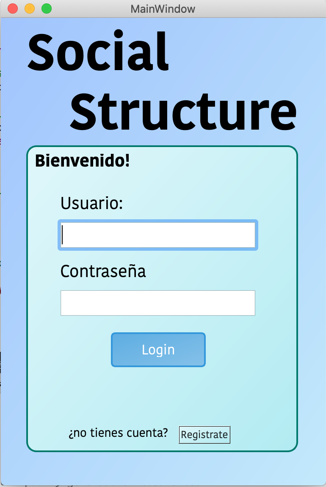
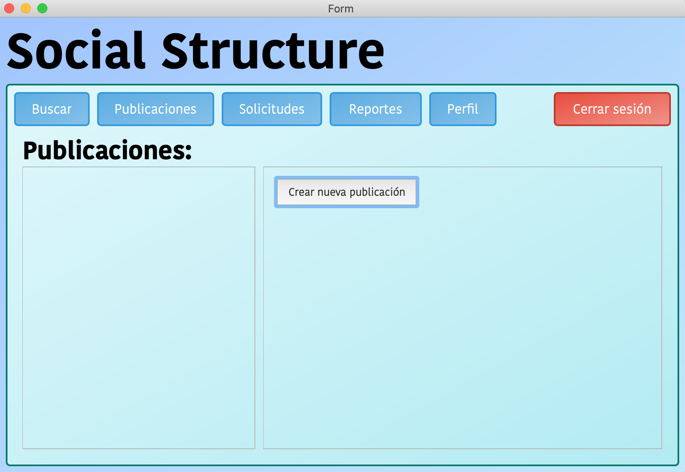
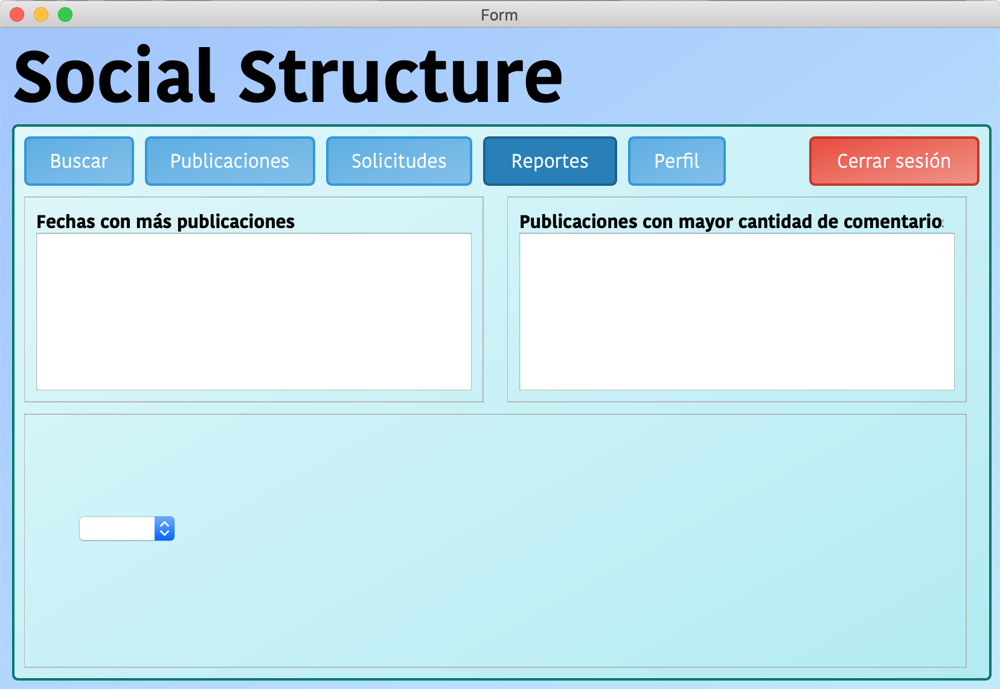
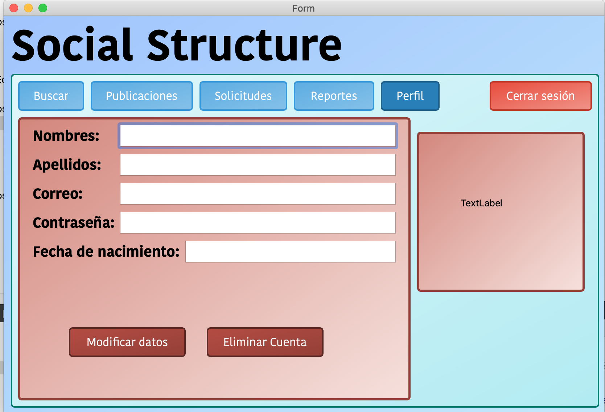
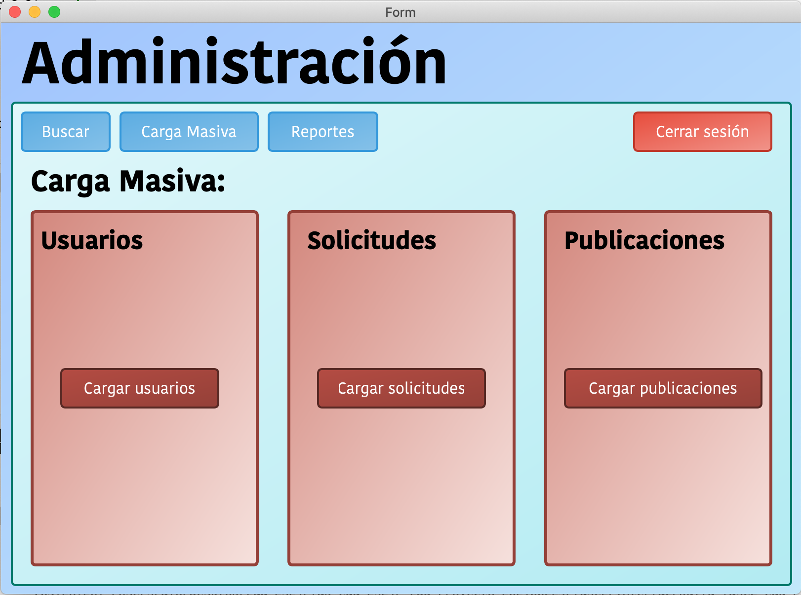

### **Manual de Usuario - Proyecto Social Structure (Fase 2)**

## **Universidad de San Carlos de Guatemala**
**Facultad de Ingeniería**  
**Escuela de Ciencias y Sistemas**  
**Curso: Estructuras de Datos**  
**Ingenieros:**  
- **Luis Espino**  
- **Edgar Ornelis**  
- **Álvaro Hernández**  

**Auxiliares:**  
- **Kevin Martinez**  
- **Carlos Castro**  
- **José Montenegro**  

**Programador:**  
Giovanni Saul Concohá Cax  
**Carne:** 202100229  
**Correo:** 3035111680110@ingenieria.usac.edu.gt  

---

### **1. Descripción General**

Este manual de usuario está diseñado para guiar a los usuarios en la interacción con la aplicación **Social Structure**. Esta plataforma simula una red social, permitiendo la gestión de usuarios, publicaciones y comentarios. El sistema ha sido desarrollado en **C++** con una interfaz gráfica (GUI) implementada en **Qt Creator**, lo que facilita una experiencia de usuario más intuitiva y accesible.

### **2. Requisitos del Sistema**

- **Sistema Operativo:** Libre (Windows, macOS, Linux)
- **Lenguaje de Programación:** C++
- **Entorno de Desarrollo:** Qt Creator IDE
- **Herramientas Adicionales:** Graphviz para la visualización de estructuras de datos
- **Repositorio:** Se debe tener acceso al código fuente y sus componentes a través de un repositorio de GitHub.

---

### **3. Inicio de Sesión**

#### **Administrador**
- **Correo:** `admin@gmail.com`  
- **Contraseña:** `EDD2S2024`  
  Al iniciar sesión como administrador, tendrá acceso a funciones de gestión como la carga masiva de usuarios, la generación de reportes, y la administración de las publicaciones y solicitudes de amistad.

#### **Usuario Regular**
Los usuarios deben registrarse proporcionando su correo electrónico, nombre, apellidos, fecha de nacimiento y una contraseña segura. Una vez registrados, pueden iniciar sesión en la aplicación.

---

### **4. Funcionalidades del Usuario Regular**

Los usuarios regulares tienen acceso a varias funcionalidades dentro de la aplicación **Social Structure**. A continuación, se detallan las opciones disponibles para gestionar publicaciones, solicitudes de amistad, reportes y el perfil personal.

#### **4.1. Publicaciones**

- **Crear Publicaciones**:  
  Los usuarios pueden crear nuevas publicaciones escribiendo texto y, opcionalmente, añadiendo imágenes. Para hacerlo, deben acceder a la sección de "Publicaciones" en el menú principal. Cada publicación que se realice será almacenada cronológicamente en el sistema.

  

- **Visualizar Feed**:  
  En el feed de publicaciones, los usuarios pueden ver tanto sus publicaciones como las de sus amigos. El feed muestra las publicaciones de forma cronológica gracias a la implementación de un **Árbol Binario de Búsqueda (ABB)** que organiza las publicaciones por fecha.

- **Comentar Publicaciones**:  
  Los usuarios tienen la opción de comentar publicaciones tanto en su feed como en las publicaciones de amigos. Los comentarios se almacenan y organizan dentro de un **Árbol B**, lo que permite que se mantengan en orden cronológico para facilitar su visualización.

- **Editar y Eliminar Publicaciones**:  
  Los usuarios pueden editar o eliminar sus propias publicaciones en cualquier momento. Estas opciones están disponibles en la página de detalles de cada publicación.

#### **4.2. Buscar**

La aplicación ofrece varias formas para que los usuarios encuentren personas y publicaciones de manera eficiente:

- **Buscar Usuarios**:  
  Los usuarios pueden buscar a otros por nombre, apellidos o correo electrónico. Esta búsqueda está optimizada gracias al **Árbol AVL**, que almacena y organiza a los usuarios por correo electrónico, facilitando las búsquedas rápidas y precisas. Además, se puede enviar solicitudes de amistad directamente desde los resultados de búsqueda.

- **Buscar Publicaciones**:  
  Los usuarios pueden buscar publicaciones específicas filtrando por la fecha en la que se realizaron. Este filtro facilita la visualización de publicaciones antiguas sin tener que recorrer todo el feed. Las publicaciones están organizadas en un **Árbol Binario de Búsqueda (ABB)** por fechas.

#### **4.3. Solicitudes de Amistad**

La sección de solicitudes permite a los usuarios gestionar sus conexiones con otros usuarios:

- **Enviar Solicitudes de Amistad**:  
  Desde la página de perfil de un usuario, los usuarios pueden enviar una solicitud de amistad. Esta solicitud será almacenada y mostrada en la lista de solicitudes del receptor.

- **Gestionar Solicitudes Recibidas**:  
  Los usuarios pueden revisar las solicitudes de amistad recibidas. Desde esta lista, pueden **aceptar**, **rechazar** o **ignorar** una solicitud. Las solicitudes aceptadas añaden a la persona como amigo en el sistema.

- **Ver Solicitudes Enviadas**:  
  Los usuarios también pueden consultar el estado de las solicitudes de amistad que han enviado a otras personas. Esta sección muestra si una solicitud está pendiente de respuesta o ha sido aceptada.

#### **4.4. Reportes**

Los usuarios tienen acceso a varios reportes que les permiten analizar su actividad en la plataforma:

- **Reporte de Publicaciones**:  
  Este reporte muestra un resumen de las publicaciones realizadas por el usuario, organizadas cronológicamente. También puede generar un gráfico de sus publicaciones por fechas, utilizando **Graphviz** para visualización.

- **Reporte de Amigos**:  
  Los usuarios pueden visualizar un reporte que muestra su lista de amigos en forma de gráfico. Esta funcionalidad utiliza la lista enlazada de amigos, generando un gráfico estructurado con las conexiones entre amigos.

- **Reporte de Solicitudes de Amistad**:  
  Este reporte permite ver un resumen de todas las solicitudes de amistad recibidas y enviadas, mostrando cuáles han sido aceptadas y cuáles están pendientes. Es útil para gestionar conexiones en la plataforma.

#### **4.5. Perfil del Usuario**

Cada usuario tiene un perfil personal que contiene su información básica y opciones de personalización:

- **Ver y Editar Perfil**:  
  Los usuarios pueden ver su perfil accediendo a la sección "Perfil" en el menú. En esta sección se muestra su información como nombre, apellidos, correo electrónico y fecha de nacimiento. También tienen la opción de editar estos datos.

- **Cambiar Contraseña**:  
  Si el usuario desea cambiar su contraseña, puede hacerlo desde la sección de configuración del perfil. El sistema requiere que el usuario ingrese su contraseña actual antes de poder establecer una nueva.

- **Amigos**:  
  Desde la página de perfil, los usuarios pueden ver su lista completa de amigos y acceder a los perfiles de estos. Esta lista está organizada mediante una **lista simplemente enlazada** que facilita la gestión y visualización de amigos.

---

### **Resumen de Funcionalidades para Usuarios Regulares**

| Funcionalidad       | Descripción                                                                                                 |
|---------------------|-------------------------------------------------------------------------------------------------------------|
| **Publicaciones**    | Crear, editar, eliminar publicaciones, comentar, ver feed cronológico.                                       |
| **Buscar Usuarios**  | Buscar personas por nombre, apellidos o correo electrónico utilizando un Árbol AVL.                         |
| **Buscar Publicaciones** | Filtrar publicaciones por fecha, organizadas cronológicamente mediante un ABB.                            |
| **Solicitudes**      | Enviar y gestionar solicitudes de amistad. Ver solicitudes recibidas, enviadas y su estado.                  |
| **Reportes**         | Generar reportes de actividad, publicaciones y amigos utilizando Graphviz.                                  |
| **Perfil**           | Ver y editar perfil personal, cambiar contraseña y gestionar lista de amigos.                                |

Esta ampliación de funcionalidades garantiza que los usuarios puedan gestionar eficientemente su actividad en la plataforma, interactuar con otros usuarios, y tener un mayor control sobre su información personal y conexiones en la red social.

---

### **5. Funcionalidades del Administrador**

#### **5.1. Gestión de Usuarios**
- El administrador tiene acceso a la **gestión de usuarios**, que incluye la capacidad de buscar, listar y eliminar usuarios.
- Los usuarios están organizados en un **Árbol AVL**, optimizando la búsqueda y organización de los usuarios por correo electrónico.

#### **5.2. Carga Masiva**
- El administrador puede realizar una **carga masiva** de usuarios, publicaciones y solicitudes de amistad mediante archivos **JSON**.
- Esta funcionalidad permite que el sistema se pueble rápidamente con datos sin tener que ingresar cada usuario manualmente.

#### **5.3. Reportes Generados**
- El sistema permite al administrador generar varios reportes gráficos con **Graphviz**:
  - **Árbol AVL** que muestra todos los usuarios registrados.
  - **Árbol ABB** que organiza las publicaciones por fechas.
  - **Árbol B** que organiza los comentarios asociados a cada publicación.
- Estos reportes se muestran directamente en la aplicación y son accesibles para su visualización sin necesidad de herramientas externas.

---

### **6. Visualización de Reportes**

Todos los reportes generados se muestran directamente en la interfaz gráfica, permitiendo una fácil visualización para los usuarios y administradores. Las gráficas se generan en tiempo real y no es necesario salir de la aplicación para ver las imágenes o gráficos generados.

---

### **7. Navegación por la Interfaz**

#### **Menú Principal**
- Desde el menú principal, los usuarios pueden acceder a su feed de publicaciones, realizar búsquedas de otros usuarios, y gestionar sus publicaciones y comentarios.
  
#### **Menú de Administrador**
- En el menú del administrador, se encuentran las opciones avanzadas de gestión, como el acceso a los reportes, la carga masiva, y la eliminación de usuarios o publicaciones.

---

### **8. Soporte y Mantenimiento**

Para soporte técnico o problemas relacionados con el sistema, los usuarios deben contactar a los administradores del sistema o a los responsables del desarrollo. Además, los usuarios deben asegurarse de mantener actualizado el software siguiendo las indicaciones de los administradores del sistema.

---

### **9. Conclusión**

Este manual de usuario proporciona una guía completa para la utilización de la plataforma **Social Structure**, tanto para usuarios regulares como para administradores. La interfaz gráfica desarrollada con Qt Creator ofrece una experiencia fácil de usar, y las funcionalidades avanzadas, como la carga masiva y los reportes gráficos, aseguran que la aplicación sea eficiente y flexible para gestionar grandes volúmenes de datos.